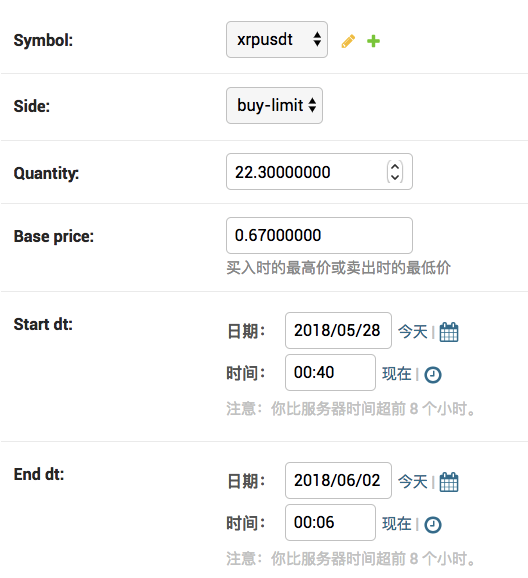
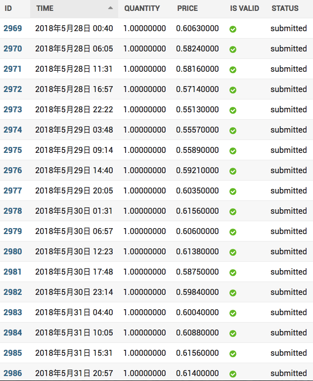

# crypto_auto_trading

自动化交易数字货币。

## 背景

分批进行交易，可以克服只选择一个时点进行买进和沽出的缺陷，从而均衡价格。尤其适合数字货币这样波动性大的商品。但是一般的定投就是每月固定时间、固定金额买入，均衡成本的效果有限。

既然分批可以均衡价格，那么分批越均匀、越细致，均衡价格的效果越大。由于批数变多后，操作的次数也随之增多，所以需要程序来进行自动化交易。

## 开发/测试环境

### 获取代码

```
git clone git@github.com:Jay54520/crypto_auto_trading.git
```

### 创建并激活虚拟环境

```bash
cd crypto_auto_trading/
python3.6 -m venv env
source env/bin/activate
```

**注意**：以下所有 bash 命令都是在激活虚拟环境后的 `crypto_auto_trading/` 目录运行

### 安装第三方依赖库

```bash
pip install -r requirements.txt
```

### 配置 settings.py

* 设置火币的交易密钥到环境变量

    ```
    export API_KEY='API Key'
    export API_SECRET='Secret Key'
    ```

* 配置好 `settings.DATABASES`

### 创建 MySQL database

创建数据库 `crypto_auto_trading`。

### 初始化数据库

```bash
./manage.py migrate
```

### 更新 symbol 信息

`./manage.py update_symbol_info`

### 创建超级用户

```bash
./manage.py createsuperuser
```

### 启动开发服务器

```python
./manage.py runserver
```

然后你可以使用创建的超级用户登录 `/admin` 后台。

### 定时任务

* 每分钟运行下单命令并将输出记录到 `/tmp/place_order.log`

```
#Ansible: place_order
* * * * * /absolute_path_to/crypto_auto_trading/env/bin/python /absolute_path_to/crypto_auto_trading/manage.py place_order >> /tmp/place_order.log 2>&1
```

## 正式部署

正式部署见 [crypto_auto_trading_deployment](https://github.com/Jay54520/crypto_auto_trading_deployment)。

## 使用

创建策略：



* Symbol：选择交易对
* Side：买/卖
* Quantity：Quote asset 的交易数量，上图为 USDT 的交易数量
* Base price：基准价格。买入时的最高价或卖出时的最低价。
* Start dt：交易开始时间
* End dt：交易结束时间

创建/修改策略后，会在 `/admin/strategy/order/` 中生成订单。



修改策略后会删除之前未提交的订单，并把已提交的订单 `is_valid` 改为 `False`，
然后在下单时只会下 `is_valid` 为 `True` 的订单。